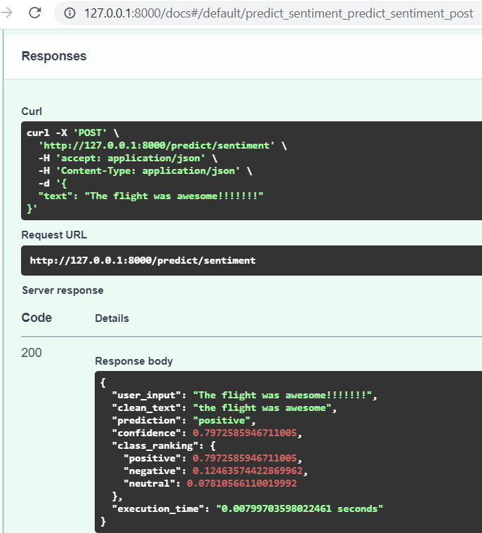

# From machine learning model to API

The main goal of this repo is to provide a simple example of how to build your machine-learning model as an API

## How to install all requirements

### 1. Git clone project

```
git clone https://github.com/Genius-Voice/ml-api.git
```

### 2. Go to project dir

```
cd ml-api
```

### 3. Set up a virtual Python environment with [venv](https://docs.python.org/3/library/venv.html)

#### For MacOS users

```
pip install virtualenv
virtualenv venv
source venv/bin/activate
```

#### For Windows users

```
pip install virtualenv
virtualenv venv
venv\Scripts\activate
```

### 4. Install pip libraries

```
pip install -r requirements.txt
```

### 5. train model

```
Open train.ipynb and run this notebook
```

### 6. DONE! 
```
You can now run the FastAPI app
```

# How to serve a model using fastAPI

### 1. Navigate to the project dir

```
cd fastapi
```

### 2. Run main.py

```
uvicorn main:app --port 8000 --reload
```

### 3. navigate to

```
http://127.0.0.1:8000/docs or http://localhost:8000/docs
```

### Example prediction for "the flight was awesome"




### How to bring FastAPI down

```
CTRL + C
```


